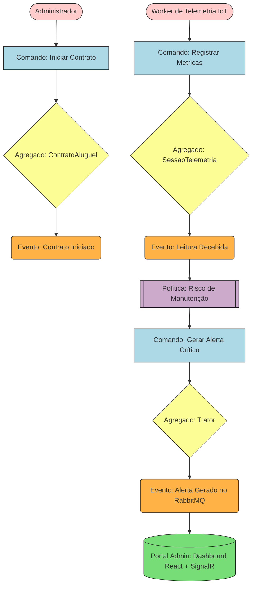

<div align="center">


<br>


</div>

#  Sistema de Gestão e Aluguel de Tratores (Telemetria IoT & DDD)
---

##  O Desafio (Contexto de Negócio)

Desenvolvimento de uma plataforma escalável capaz de realizar a gestão completa dos contratos de locação de uma frota de tratores. Simultaneamente, o sistema deve ser capaz de processar um fluxo massivo de informações críticas de telemetria enviadas diretamente por sensores **IoT (Internet of Things)** acoplados aos equipamentos.

Os sensores realizam leituras frequentes de indicadores como:
* Nível de combustível e nível de óleo;
* Pressão dos pneus;
* Rotação e temperatura do motor;
* Velocidade e geolocalização via GPS.

### Requisitos de Arquitetura e Negócio
* **Processamento em Tempo Real:** Ingestão contínua de dados de sensores para garantir o monitoramento ativo.
* **Portal Administrativo:** Visão analítica global da frota, com fila de alertas críticos de manutenção em tempo real.
* **Portal do Cliente:** Transparência total para o locatário e gestão visual dos contratos de aluguel.

---

##  Como Rodar o Projeto (Ambiente Local)

Este projeto foi containerizado para garantir que **qualquer avaliador técnico** consiga rodá-lo localmente com facilidade, sem a necessidade de instalar SDKs do .NET ou Node.js.

### Pré-requisitos
- **Docker** e **Docker Compose** instalados na sua máquina.

### Passo a Passo

1. Clone o repositório e navegue até a pasta raiz:
   ```bash
   git clone https://github.com/LuizhBrandao/Sistema-de-Gestao-e-Aluguel-de-Tratores.git
   cd Sistema-de-Gestao-e-Aluguel-de-Tratores
   ```

2. Execute o seguinte comando para construir as imagens e subir a arquitetura completa:
   ```bash
   docker-compose up -d --build
   ```

3. O Docker Compose iniciará todo o ecossistema:
   * **SQL Server** (Banco de dados na porta `1433`).
   * **RabbitMQ** (Mensageria e eventos na porta `5672` / Painel: `15672`).
   * **API Backend (.NET 10)** (Na porta `5000`).
   * **IoT Worker (.NET 10)** (Gerador contínuo de telemetria em background).
   * **Frontend Web App (React + Vite)** (Na porta `80`).

4. **Acesse o Dashboard no seu navegador:**
    **http://localhost:80**

Lá você poderá visualizar o **Painel de Monitoramento** reagindo em tempo real aos dados injetados via SignalR.

---

##  Tecnologias Utilizadas (Tech Stack)

Este projeto foi construído com foco em **Alta Performance, Escalabilidade e Arquitetura Limpa**:

* **Frontend:** React, Vite, TypeScript e Vanilla CSS (Design *Glassmorphism*).
* **Backend:** .NET 10 (Minimal APIs, Background Services).
* **Arquitetura:** Domain-Driven Design (DDD), Clean Architecture, CQRS, Event-Driven Architecture (EDA).
* **Mensageria (IoT):** RabbitMQ e MassTransit.
* **Tempo Real:** SignalR (WebSockets).
* **Banco de Dados:** SQL Server via Entity Framework Core.
* **Testes Automatizados:** xUnit, Moq, FluentAssertions (Cobertura 100% no Core Domain).
* **DevOps:** Docker e Docker Compose (Multi-stage builds isolados).

---

##  Engenharia de Software: Fluxo de Event Storming

Para solucionar a alta complexidade do domínio, a modelagem seguiu as etapas do Event Storming:

1. **Eventos de Domínio:** Fatos imutáveis (`ContratoIniciado`, `LeituraDeSensorRecebida`).
2. **Agregados:** Fronteiras lógicas de negócio (`ContratoAluguel`, `Trator`).
3. **Políticas de Negócio:** Automações assíncronas (Risco de Manutenção dispara Alertas Críticos).
4. **Modelos de Leitura:** Projeções otimizadas (CQRS).

### Mapeamento Lógico (Mermaid)



<br>

🟨 Amarelo (Aggregate): Cluster de entidades que encapsula regras de validação e estado.

🟧 Laranja (Domain Event): Mudança significativa ocorrida no negócio. É um dado histórico e imutável.

🟪 Lilás (Policy): Regras automáticas disparadas por eventos assíncronos.

🟩 Verde (Read Model): Projeções e dashboards otimizados para rápida resposta de leitura.

## 🚀 Como Rodar o Projeto

### Pré-requisitos
- [Docker Desktop](https://www.docker.com/products/docker-desktop/) instalado e em execução.

### Subindo a aplicação
```bash
docker-compose up -d --build
```
Esse comando sobe **4 containers**: SQL Server, RabbitMQ, a API e o Worker IoT.

---

## 🗺️ Rotas e Endpoints Disponíveis

Após subir a aplicação, todas as rotas ficam disponíveis a partir de `http://localhost:5257`.

### Interfaces Web (Front-End)

| Rota | Descrição |
|---|---|
| [`/`](http://localhost:5257/) | 📊 **Dashboard Administrativo** — Visão geral com KPIs, distribuição e alertas. |
| [`/tratores.html`](http://localhost:5257/tratores.html) | 🚜 **Monitoramento da Frota** — Gauges em tempo real de temperatura, pressão, óleo e RPM. |
| [`/clientes.html`](http://localhost:5257/clientes.html) | 👥 **Gestão de Clientes** — Listagem e cadastro de clientes. |
| [`/contratos.html`](http://localhost:5257/contratos.html) | 📋 **Contratos de Aluguel** — Histórico e abertura de novos contratos. |
| [`/alertas.html`](http://localhost:5257/alertas.html) | 🔔 **Central de Alertas** — Feed em tempo real de anomalias detectadas via SignalR. |
| [`/swagger`](http://localhost:5257/swagger) | 📚 **Documentação Interativa (Swagger UI)** — Permite testar endpoints da API. |

### API REST — Gestão de Tratores e Telemetria (`/api/tratores`)

| Método | Rota | Descrição |
|---|---|---|
| `POST` | `/api/tratores` | Cadastra um novo equipamento na frota. |
| `GET` | `/api/tratores/{id}` | Consulta o status atual e as últimas métricas de um trator específico. |
| `GET` | `/api/tratores/dashboard` | Lista todos os tratores e métricas em alta performance (Dapper + CQRS). |
| `POST` | `/api/tratores/telemetria` | Recebe carga de dados dos sensores IoT do equipamento. |

### API REST — Gestão de Clientes (`/api/clientes`)

| Método | Rota | Descrição |
|---|---|---|
| `POST` | `/api/clientes` | Cadastra um novo cliente no sistema. |
| `GET` | `/api/clientes` | Lista todos os clientes cadastrados. |

### API REST — Gestão de Contratos de Aluguel (`/api/contratos`)

| Método | Rota | Descrição |
|---|---|---|
| `POST` | `/api/contratos` | Abre um novo contrato de aluguel e atualiza o status do equipamento. |
| `GET` | `/api/contratos` | Lista todo o histórico de contratos da empresa. |

### Tempo Real — SignalR Hub

| Rota | Descrição |
|---|---|
| `/hubs/monitoramento` | 📡 Hub SignalR para recebimento de alertas críticos em tempo real. Evento: `ReceberAlerta`. |

### Serviços de Infraestrutura

| Serviço | URL | Descrição |
|---|---|---|
| RabbitMQ Management | [`http://localhost:15672`](http://localhost:15672) | Painel de controle do RabbitMQ (usuário: `guest`, senha: `guest`). |
| SQL Server | `localhost:1433` | Banco de dados (usuário: `sa`, senha: `TractorAdmin@123!`). |

---

## 📐 Conceitos e Padrões de Arquitetura Praticados

* **Domain-Driven Design (DDD):** Foco estratégico nas regras de negócio da aplicação, permitindo o isolamento de contextos delimitados (Bounded Contexts) para Contratos e Telemetria.

* **Event-Driven Architecture (EDA):** Modelagem focada em fluxos de eventos para suportar alta escalabilidade e desacoplamento na recepção contínua de sinais de IoT.

* **CQRS (Command Query Responsibility Segregation):** Estrutura conceitual voltada à separação completa de fluxos de modificação de dados (comandos dos sensores) e fluxos analíticos de exibição (consultas de painéis e extratos de custo dinâmicos).

---
<p align="center">
Desenvolvido por <strong>Luiz Brandão</strong> como projeto prático e de portfólio de arquitetura avançada de software.
</p>
